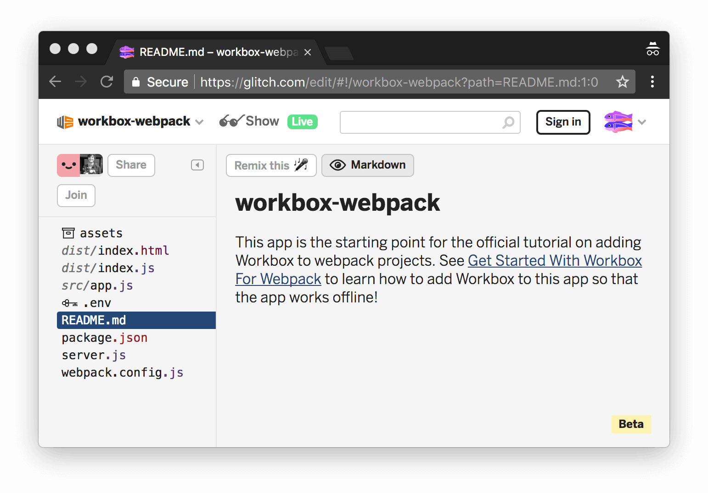

project_path: /web/tools/_project.yaml
book_path: /web/tools/_book.yaml
description: TODO

{# wf_updated_on: 2017-10-19 #}
{# wf_published_on: 2017-10-19 #}

# Get Started With Workbox For Webpack {: .page-title }

<<_shared/intro.md>>

## Step X: Set up your project {: #setup }

The web app that you're going to add Workbox to is hosted on [Glitch][Glitch].
First, you need to set up Glitch so that you can edit the code.

[Glitch]: https://glitch.com/about/

1. Open the [demo](https://glitch.com/edit/#!/workbox-webpack).

     <figure>
       
       <figcaption>
         <b>Figure TODO</b>. TODO
       </figcaption>
     </figure>

1. Click **workbox-webpack** at the top-left of the page. The **Project
   info and options** dropdown appears.
1. Click **Remix This**. Your browser redirects to an editable copy of
   the project.

<<_shared/try.md>>

## Step X: Install Workbox {: #install }

Next, you're going to add Workbox to the project to enable an offline
experience. When users visit the page while offline, they'll see the content
from the last time that they had an Internet connection.

1. Click `package.json` to open that file.
1. Click **Add package**.
1. Type `workbox-webpack-plugin` within the **Add Package** text box, then
   press <kbd>Enter</kbd>.

<!-- TODO fix formatting -->

     Note: This is equivalent to running `npm install
     workbox-webpack-plugin`. In your own projects, you'll probably want to
     save Workbox as a [development dependency][devDependencies] instead by
     running `npm install workbox-webpack-plugin --save-dev`, since
     `workbox-webpack-plugin` is a build-time tool.</aside>

[devDependencies]: https://docs.npmjs.com/files/package.json#devdependencies
   
Every time you make a change to your code, Glitch automatically
re-builds and re-deploys your app. When you've got the live version of the
app open in a tab, that automatically refreshes, too.

## Step X: Add Workbox to your Webpack build process {: #webpack }

1. Click `webpack.config.js` to open that file.
1. Import the Workbox plugin in `webpack.config.js`.

        const path = require('path'),
              htmlPlugin = require('html-webpack-plugin'),
              cleanPlugin = require('clean-webpack-plugin'),
              dist = 'dist',
              workboxPlugin = require('workbox-webpack-plugin');

1. Call the Workbox plugin as the last step in `plugins`.

        plugins: [
          new cleanPlugin([dist]),
          new htmlPlugin({
            filename: 'index.html',
            title: 'Get Started With Workbox For Webpack'
          }),
          new workboxPlugin({
            globDirectory: dist,
            globPatterns: ['**/*.{html,js}'],
            swDest: path.join(dist, 'sw.js')
          })
        ]

The order of the plugin workflow is important, so here's a thorough explanation:

* The `dist` variables provides a path to the output directory.
* The `cleanPlugin` plugin deletes `dist`.
* The `htmlPlugin` plugin re-generates the output and places it back in `dist`.
* Always call the `workboxPlugin` plugin last. Workbox inspects the
  contents of your output, and determines if any of the files have changed
  since the last time you built your app. Later you'll learn
  how Workbox tracks changes.

Here's what each property in the `workboxPlugin` config means:

* `globDirectory`. Where Workbox should watch for changes. `globPatterns`
  is relative to this directory.
* `globPatterns`. What files should be precached. In plain English, the
  wildcard pattern `**/*.{html,js}` translates to "cache every HTML and JS
  file in `globDirectory`, or any of its sub-directories".
* `swDest`. Where Workbox should output the service worker that it generates.

## Step X: Register and inspect the generated service worker {: #register }

Workbox has generated a service worker, but your app isn't using it, yet.

1. Click `src/index.js` to open that file.
1. Register your service worker at the bottom of `init()`.

    <pre class="prettyprint">function init() {
      let title = document.createElement('h1');
      title.textContent = 'Top 10 Hacker News Stories';
      document.body.appendChild(title);
      let list = document.createElement('ol');
      document.body.appendChild(list);
      fetchTop10().then(stories => renderTop10(stories));
      <strong>if ('serviceWorker' in navigator) {
        window.addEventListener('load', () => {
          navigator.serviceWorker.register('/sw.js').then(registration => {
            console.log('SW registered: ', registration);
          }).catch(registrationError => {
            console.log('SW registration failed: ', registrationError);
          });
        });
      }</strong>
    }</pre>

1. In the live version of your app, go to the **Application** panel of DevTools,
   then go to the **Service Workers** pane.
1. Click **sw.js**, next to **Source**.

The source code for the service worker that Workbox generated opens in the
**Sources** panel of DevTools. It should look something like this:

    importScripts('workbox-sw.prod.v2.1.0.js');

    /**
     * DO NOT EDIT THE FILE MANIFEST ENTRY
     *
     * The method precache() does the following:
     * 1. Cache URLs in the manifest to a local cache.
     * 2. When a network request is made for any of these URLs the response
     *    will ALWAYS comes from the cache, NEVER the network.
     * 3. When the service worker changes ONLY assets with a revision change are
     *    updated, old cache entries are left as is.
     *
     * By changing the file manifest manually, your users may end up not 
     * receiving new versions of files because the revision hasn't changed.
     *
     * Please use workbox-build or some other tool / approach to generate the
     * file manifest which accounts for changes to local files and update the
     * revision accordingly.
     */
    const fileManifest = [
      {
        "url": "index.html",
        "revision": "7dc612bd22a1710ad8c318480f474ea5"
      },
      {
        "url": "index.js",
        "revision": "43df4671bcff4065bb9aadb4f54f91ee"
      }
    ];

    const workboxSW = new self.WorkboxSW();
    workboxSW.precache(fileManifest);

Here's what the generated service worker code is doing:

* `importScripts('workbox-sw.prod.v2.1.0.js');` imports Workbox's service
  worker library. You can inspect this file from the **Sources** panel of
  DevTools.
* The `fileManifest` array lists all of the resources that Workbox is
  precaching. This list is determined by the `globDirectory`
  and `globPatterns` properties that you define in `webpack.config.js`, as
  mentioned in the last section.
* Each resource has a `revision` property. This is how Workbox determines
  when to update a resource. Each time you build your app, Workbox generates
  a hash based on the contents of the resource. If the contents change, then
  the `revision` hash changes, and therefore the service worker code changes.
* When the service worker runs, it writes the `url` and `revision` of each
  resource to [IndexedDB][IDB] (IDB) if it doesn't exist. If the resource does
  exist, the service worker checks that the `revision` in its code matches the
  `revision` in IDB. If the hashes don't match, then the resource has changed,
  and therefore the service worker needs to download the updated resource and
  update the hash in IDB.

In sum, Workbox only re-downloads resources when they change, and ensures
that your app always the most up-to-date version of each resource.

[IDB]: https://developer.mozilla.org/en-US/docs/Web/API/IndexedDB_API

Your app now sort-of works offline. Try it now:

1. In the live version of your app, use DevTools to go offline again.
   Focus DevTools and press <kbd>Command</kbd>+<kbd>Shift</kbd>+<kbd>P</kbd>
   (Mac) or <kbd>Control</kbd>+<kbd>Shift</kbd>+<kbd>P</kbd> (Windows, Linux)
   to open the **Command Menu**. Type `Offline`, select **Go offline**,
   then press <kbd>Enter</kbd>.
1. Reload the page. The title of the page appears, but the list of the top
   10 stories doesn't.
1. Click the **Network** tab in DevTools. The request for `topstories.json` is
   red, meaning that it failed. This is why the list isn't appearing. The app
   tries to make a request for
   `https://hacker-news.firebaseio.com/v0/topstories.json`, but the request
   fails since you're offline.
1. Use the **Command Menu** in DevTools to go back online.

## Step X: Add runtime caching {: #runtime }

With runtime caching, your service worker can store the top Hacker News stories
locally, on the user's device. This enables a better offline experience. When
the user is offline, they obviously won't be able to see new content, but at
least they can browse the content from the last time they had an Internet
connection.

1. Back in Glitch, open `webpack.config.js` again.
1. Add a `runtimeCaching` property to your Workbox configuration.

     new workboxPlugin({
       globDirectory: dist,
       globPatterns: ['**/*.{html,js}'],
       swDest: path.join(dist, 'sw.js'),
       runtimeCaching: [
         {
           urlPattern: new RegExp('https://hacker-news\.firebaseio\.com'),
           handler: 'staleWhileRevalidate'
         }
       ]
     })

`urlPattern` is a regular expression pattern telling Workbox which
URLs to store locally. `handler` defines the caching strategy that Workbox
will use for any matching URL. See [The Offline Cookbook][cookbook] for more
on caching strategies.

[cookbook]: /web/fundamentals/instant-and-offline/offline-cookbook/

Note: The `staleWhileRevalidate` caching strategy is good enough for this
tutorial, but it does introduce a complication, as you'll see in the next
section.

The app now provides a reasonably complete offline experience. Try it now:

1. Reload the live version of your app.
1. Reload it again.
1. Use the DevTools **Command Menu** to go back offline.
1. Reload the app. The app now displays the content from the last time
   that you were online.

## Step X: Create your own service worker {: #inject }

Up until now, you've been letting Workbox generate your entire service
worker. If you've got a big project, or you want to customize how you cache
certain resources, or do custom logic in your service worker, such as add
support for push notifications, then you need to create a custom service
worker that calls Workbox instead. Think of the service worker code you write
as a template. You write your custom logic with placeholder keywords that
instruct Workbox where to inject its code. Try it now by adding support for
push notifications into your app:

1. Go to `package.json` and install the `workbox-sw` package.
1. Write down the version number of `workbox-sw` that gets installed. You'll
   need it later.
1. Add the following code to the `init()` function in `app.js`.

function init() {
  let title = document.createElement('h1');
  title.textContent = 'Top 10 Hacker News Stories';
  document.body.appendChild(title);
  let list = document.createElement('ol');
  document.body.appendChild(list);
  fetchTop10().then(stories => renderTop10(stories));
  if ('serviceWorker' in navigator) {
    window.addEventListener('load', () => {
      navigator.serviceWorker.register('/sw.js').then(registration => {
        console.log('SW registered: ', registration);
        registration.pushManager.subscribe();
      }).catch(registrationError => {
        console.log('SW registration failed: ', registrationError);
      });
    });
  }
}

Warning: It's terrible UX to ask for push notification permissions
out-of-context. Never do this in a real app. See [Permission UX][UX].

[UX]: /web/fundamentals/push-notifications/permission-ux

1. Click **New File**, enter `src/sw.js`, then press <kbd>Enter</kbd>.
1. Insert the following code into `src/sw.js`.

// TODO: Replace Xs.
importScripts('/node_modules/workbox-sw/build/importScripts/workbox-sw.prod.v2.1.0.js');

// Note: Ignore the error that Glitch raises about WorkboxSW being undefined.
const workbox = new WorkboxSW();

workbox.registerRoute(
  new RegExp('^https://hacker-news.firebaseio.com'),
  workbox.strategies.staleWhileRevalidate()
);

self.addEventListener('push', (event) => {
  const title = 'Get Started With Workbox For Webpack';
  const options = {
    body: event.data.text()
  };
  event.waitUntil(self.registration.showNotification(title, options));
});

workbox.precache([]);

1. Replace each `X` in `importScripts('.../workbox-sw.prod.X.X.X.js')` with
   the version number of `workbox-sw` that you noted earlier.
1. Update the Workbox plugin in `webpack.config.json` to match the following
   code.

     new workboxPlugin({
       globDirectory: dist,
       globPatterns: ['**/*.{html,js}'],
       swSrc: './src/sw.js',
       swDest: path.join(dist, 'sw.js')
     })

The app is now all set to handle push notifications. Try it now:

1. In the live version of your app, go to the **Application** panel of
   DevTools.
1. Click the **Service Workers** tab.
1. Enter some text into the **Push** text box, then click **Push**.

   Note: If you don't see the **Push** text box, you're running an older version
   of Chrome. Click the **Push** link instead. You should see a notification
   with the text `Test push message from DevTools`.

